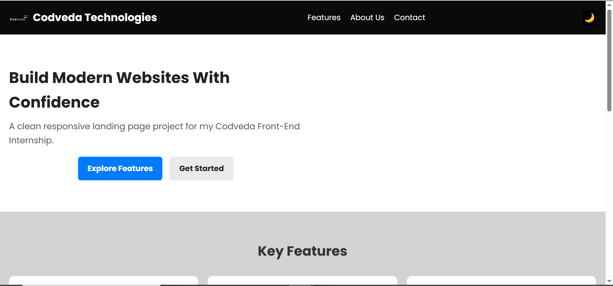
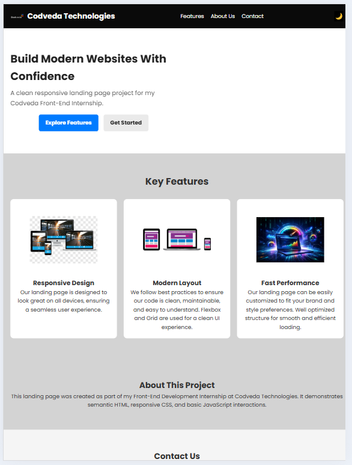
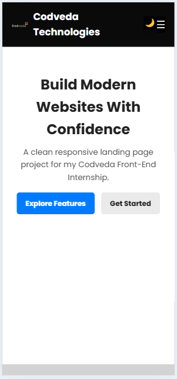

# Codveda Frontend Internship - Level 1 Task 1

## 📌 Project Title
Responsive Landing Page

## 🚀 Project Description
This is a responsive landing page built as part of my Front-End Development Internship at Codveda Technologies.  
The project demonstrates semantic HTML, modern CSS styling, responsive layouts, and basic JavaScript interactions.

## 🎯 Features
- Responsive design (mobile, tablet, desktop)
- Sticky navigation bar with scroll shadow
- Mobile menu toggle
- Smooth scrolling
- Hover effects on buttons and cards
- Scroll-to-top button
- Dark/Light theme toggle
- Fade-in animations on page load

## 🛠️ Technologies Used
- HTML5
- CSS3 (Flexbox & Grid)
- JavaScript (DOM Manipulation)

## 📸 Screenshots
### Desktop View

### Tablet View

### Mobile View

## 🌍 Live Demo
(After deployment, paste Netlify/Vercel link here)

## 📂 GitHub Repository

## 👨‍💻 Author
**Ekene Martins Okoro**
- GitHub: https://github.com/EKENEMARTINS
- LinkedIn: https://linkedin.com/in/ekene-martins-okoro-41a51b383
